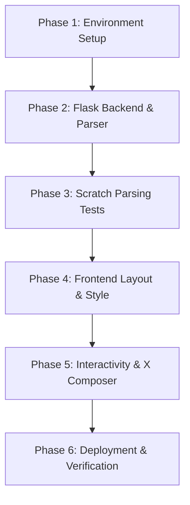

# Implementation Plan & Task Log

This document outlines the sequential phases and step-by-step tasks followed to plan, build, test, and run the BigQuery Release Notes Navigator application.

---

## 📋 Task Breakdown & Status

### Phase 1: Environment Setup
- [x] Create project structure and directories (`templates/`, `static/css/`, `static/js/`).
- [x] Write [requirements.txt](file:///mnt/c/kkLab/kaggle-ai-agents/agy-cli-projects/requirements.txt) specifying core dependencies (`flask`, `requests`, `beautifulsoup4`).
- [x] Initialize a dedicated Python virtual environment (`venv`) to isolate dependencies.
- [x] Perform pip dependency installation inside the virtual environment.

### Phase 2: Flask Backend & XML Parser
- [x] Design [app.py](file:///mnt/c/kkLab/kaggle-ai-agents/agy-cli-projects/app.py) core.
- [x] Build feed fetching using standard `urllib.request`.
- [x] Create an XML parsing routine to map the Atom namespace (`http://www.w3.org/2005/Atom`).
- [x] Implement the BeautifulSoup splitter logic to break down dates containing multiple heading tags (`<h3>`, `<h4>`) into distinct, individual update entities.
- [x] Set up an in-memory server-side cache with a 15-minute Time-To-Live (TTL) to prevent feed rate-limiting.
- [x] Include a force-refresh capability via `?refresh=true` queries.

### Phase 3: Testing & Parsing Validation
- [x] Compile check python syntax using py_compile.
- [x] Write a scratch test script [test_parse.py](file:///home/kg/.gemini/antigravity-cli/brain/08c2fa6c-d0c4-4c4b-ae25-b04a3fdac324/scratch/test_parse.py) to check feed fetching.
- [x] Execute parser validation test, confirming 60+ release note entries fetched and sliced correctly.

### Phase 4: Frontend Structure & Premium Styling
- [x] Build [templates/index.html](file:///mnt/c/kkLab/kaggle-ai-agents/agy-cli-projects/templates/index.html) with header controls, search query bars, release lists, sticky sharing workspaces, and simulation feed tabs.
- [x] Design custom stylesheet [static/css/style.css](file:///mnt/c/kkLab/kaggle-ai-agents/agy-cli-projects/static/css/style.css) featuring:
  - Deep space color palette (slate dark bg, glowing borders).
  - Categorized color-coded status badges (Features, Changes, Deprecations).
  - Floating sticky panels and custom scrollbars.
  - Skeleton loaders indicating async page transitions.
  - Multi-status slide-in toasts.

### Phase 5: Client-Side Interactivity & Twitter Composer
- [x] Write [static/js/app.js](file:///mnt/c/kkLab/kaggle-ai-agents/agy-cli-projects/static/js/app.js) event listeners for tabs, search inputs, and category pills.
- [x] Bind cards to populate detail workspaces and pre-fill Twitter draft templates.
- [x] Incorporate X-Compliant URL character counting (treating all links as exactly 23 characters matching `t.co`).
- [x] Animate SVG circular progress rings with alert colors (Blue/Yellow/Red) based on character limits.
- [x] Create clipboard copying actions and mock timeline logs.

### Phase 6: Local Server Deploy
- [x] Start Flask development server on port `5000`.
- [x] Verify status logs to ensure socket binding was successful.
