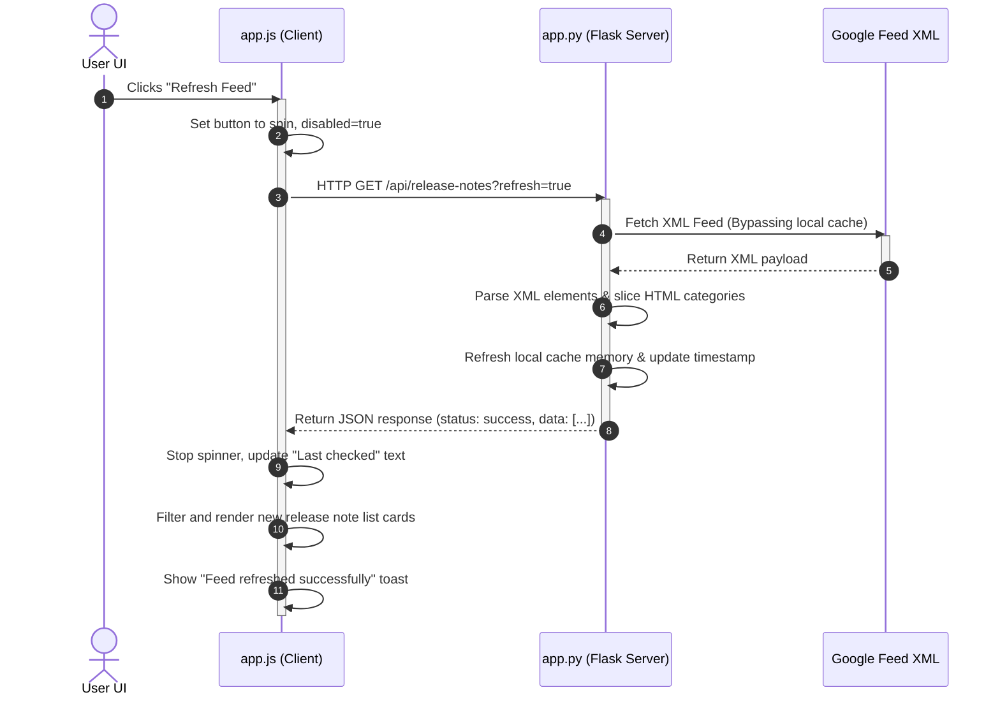
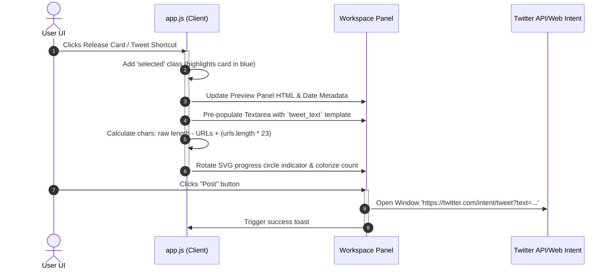

# System Architecture & Technical Deep-Dive

This document explains the technical design, codebase division, and runtime flows of the BigQuery Release Notes Navigator application.

---

## 🌟 Key Application Features

1. **Granular Release Slicing**: Rather than listing a day's releases as a single block, the backend splits daily logs by heading tag elements (`<h3>`), enabling users to read, filter, and share specific features, deprecations, or changes.
2. **In-Memory Cache (TTL: 15m)**: Prevents redundant round-trips to Google's RSS servers. Serves instant responses, reverting to cache bypass only when the user triggers the manual "Refresh Feed" action.
3. **X-Compliant URL Composer**: Employs URL regex parsing to treat all links as exactly 23 characters (matching Twitter's real `t.co` shortening logic), ensuring users see authentic character limits.
4. **Dynamic SVG Loader**: Animates composer state gauges using SVG circle stroke formulas that dynamically map draft length alerts (Blue ➡️ Amber ➡️ Red).
5. **Interactive Session Simulator**: Contains a stateful logger tracking mock tweet posts to present a local timeline feed inside the UI.

---

## 🏛️ Architecture Breakdown

The project follows a clean separation of concerns between backend parsing and rendering state:

```
┌──────────────────────────────────────┐
│            CLIENT SIDE               │
│  (HTML5 / CSS Variables / app.js)    │
└──────────────────┬───────────────────┘
                   │
         JSON API (HTTP/Fetch)
                   │
┌──────────────────▼───────────────────┐
│            SERVER SIDE               │
│        (Flask / app.py)              │
└──────────────────┬───────────────────┘
                   │
           HTTPS XML Feed
                   │
┌──────────────────▼───────────────────┐
│    Google BigQuery Release Feed      │
└──────────────────────────────────────┘
```

### 1. Server-Side Details (`app.py`)
Written in Python Flask, the server is responsible for fetching, parsing, and caching.

* **Feed Fetching**: Queries `docs.cloud.google.com/feeds/bigquery-release-notes.xml` with headers simulating typical browser traffic to bypass user-agent blocks.
* **Atom XML Parsing**: Inspects root and entries mapping the Atom namespace (`http://www.w3.org/2005/Atom`).
* **HTML Element Grouping**: Uses **BeautifulSoup** to traverse feed description chunks. Iterates over contents to group descriptions under their respective category headings (`<h3>`), transforming flat HTML into structured arrays of updates.
* **Cache Controller**: Keeps track of `last_updated` timestamps. If `< 15` minutes old, API calls serve cache hits. If older or `refresh=true` is requested, it forces a download.

---

### 2. Client-Side Details (`static/js/app.js` & `static/css/style.css`)
Powered by responsive Vanilla styles and event-driven JavaScript:

* **State Store**: Maintains local structures of `releases`, `filteredReleases`, `selectedRelease`, and `simulatedTweets`.
* **Dynamic Rendering & Filters**: Search fields debounced by `250ms` and category pills filter the `releases` array on the fly without refreshing the page.
* **Workspace Synchronizer**: Updates the sticky side panel with HTML previews, resets the composer's draft textarea, and triggers circular SVG character gauges.
* **Toasts Interface**: An asynchronous message stack injecting temporary indicator blocks that slide out and self-destruct after `3.5s`.

---

## 🔄 End-to-End Request & Response Flows

### Flow A: Clicking "Refresh Feed" (Force Update)



---

### Flow B: Selecting a Card and Tweeting


