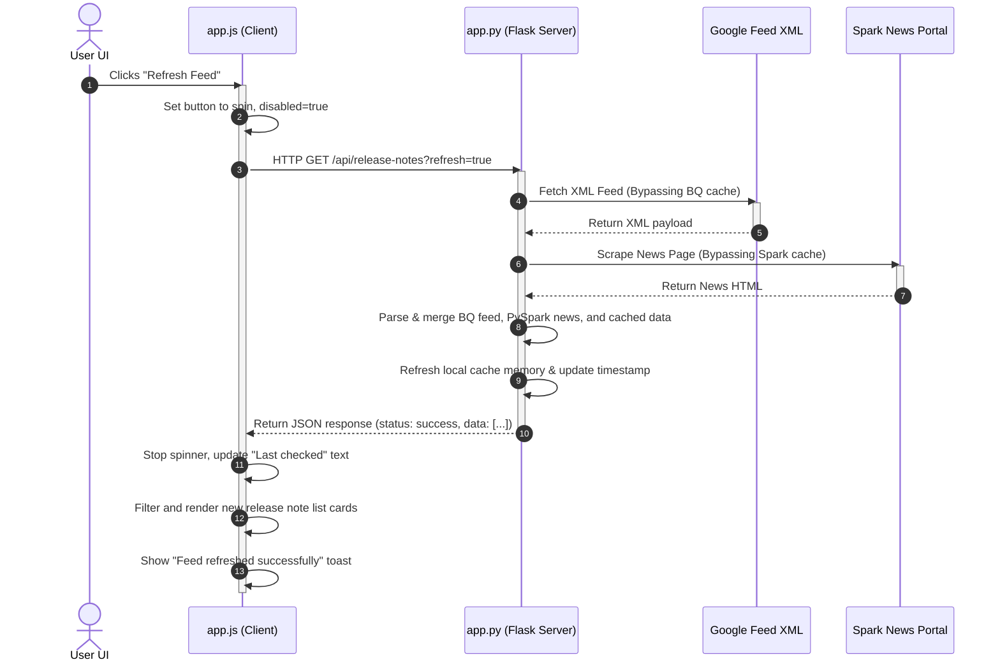
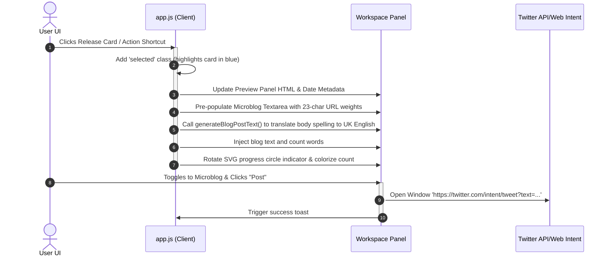

# System Architecture & Technical Deep-Dive

This document explains the technical design, codebase division, and runtime flows of the Modern Data Engineering Release Explorer application.

---

## 🌟 Key Application Features

1. **Granular Release Slicing**: Rather than listing a day's releases as a single block, the backend splits daily logs by heading tag elements (`<h3>`), enabling users to read, filter, and share specific features, deprecations, or changes.
2. **Multi-Source Fetching & Scraping**: Integrates live Google Cloud BigQuery RSS parsing alongside custom HTML scrapers querying the Apache Spark news feeds dynamically, combined with high-fidelity Snowflake and Oracle documentation caches.
3. **In-Memory Cache (TTL: 15m)**: Prevents redundant round-trips to external documentation and RSS servers. Serves instant responses, reverting to cache bypass only when the user triggers the manual "Refresh Feed" action.
4. **Dual Sharing Workspace**: 
   * **Microblog**: pre-populates X-compliant drafts, counting all URLs as 23 characters (matching `t.co` shortening logic) and animating an circular SVG remaining character gauge.
   * **200-Word Blog**: Generates structural UK English blog post copies, appending relevant engine hashtags and source hyperlinks.
5. **Interactive Session Simulator**: Contains a stateful logger tracking mock microblog posts to present a local timeline feed inside the UI.
6. **Themes & Exporters**: Integrates light-theme overrides via body class toggle toggles and filtered CSV download exporters.

---

## 🏛️ Architecture Breakdown

The project follows a clean separation of concerns between backend parsing and rendering state:

```
┌──────────────────────────────────────┐
│            CLIENT SIDE               │
│  (HTML5 / CSS Variables / app.js)    │
└──────────────────┬───────────────────┘
                   │
         JSON API (HTTP/Fetch)
                   │
┌──────────────────▼───────────────────┐
│            SERVER SIDE               │
│        (Flask / app.py)              │
└──────────────────┬───────────────────┘
         ┌─────────┼─────────┐
         │         │         │
    (RSS Feed)  (Scraper) (Local Cache)
         │         │         │
    BigQuery    PySpark   Snowflake & Oracle
```

### 1. Server-Side Details (`app.py`)
Written in Python Flask, the server is responsible for fetching, parsing, and caching.

* **BigQuery XML Parser**: Queries `docs.cloud.google.com/feeds/bigquery-release-notes.xml` and parses Atom tags. Uses BeautifulSoup to group sibling nodes under respective headings (`<h3>`), transforming flat HTML into structured arrays of updates.
* **PySpark Scraper**: Crawls `https://spark.apache.org/news/index.html` dynamically, parsing header titles, publication dates, and article descriptions to extract official release logs.
* **Enterprise Fallbacks**: Merges structured offline cache lists for Snowflake and Oracle 26ai.
* **Cache Controller**: Caches unified sorted lists. Bypassed only when `refresh=true` is requested.

---

### 2. Client-Side Details (`static/js/app.js` & `static/css/style.css`)
Powered by responsive Vanilla styles and event-driven JavaScript:

* **State Store**: Maintains local structures of `releases`, `filteredReleases`, `selectedRelease`, and `simulatedTweets`.
* **Dynamic Rendering & Filters**: Search fields debounced by `250ms` and category / source pills filter the `releases` array on the fly without refreshing.
* **Composers & Spellers**: Features a US-to-UK English spelling parser (*optimised*, *analysing*) to format ~200-word blogs.
* **Toasts Interface**: Injectable toast element wrapper slide-ins.

---

## 🔄 End-to-End Request & Response Flows

### Flow A: Clicking "Refresh Feed" (Force Update)



---

### Flow B: Selecting a Card and Compiling Drafts


